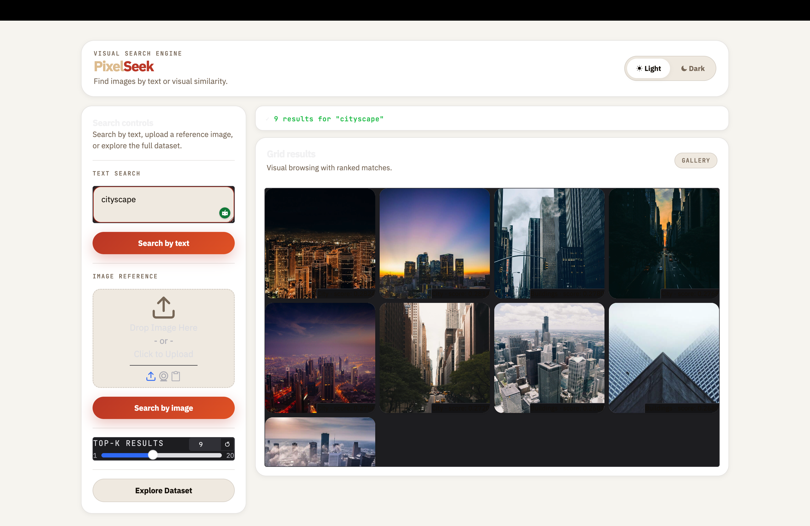
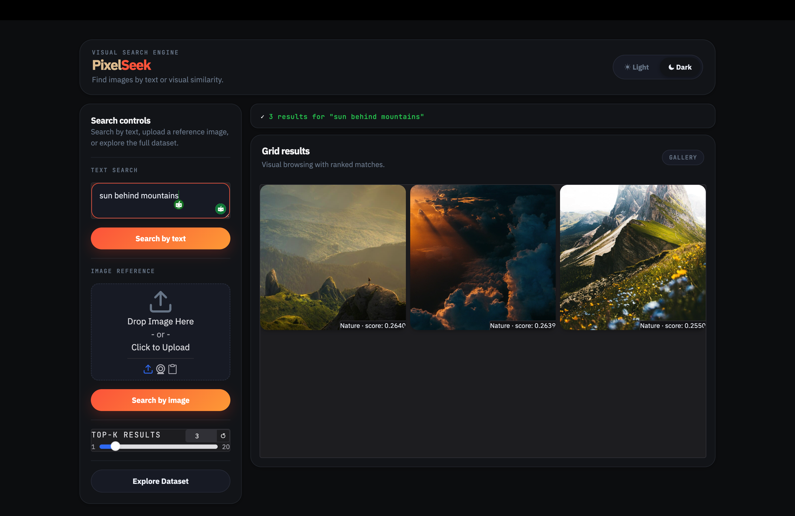

# PixelSeek

- PixelSeek is an image retrieval application powered by deep learning
- It allows users to search and retrieve visually similar images from a dataset
- The system uses feature embeddings and efficient indexing for fast and accurate results

# Application Overview

- Extracts meaningful features from images using deep learning models
- Stores these features in a FAISS index for similarity search
- Retrieves closest matching images for a given query
- Designed to work efficiently even with large image datasets

# Key Components

- Image feature extraction using deep learning models
- FAISS based indexing for similarity search
- JSON based path mapping for dataset management
- Query pipeline using clip_search for retrieving similar images

# Project Structure

- app.py main application entry point
- build_index.py generates paths.json and index.faiss
- clip_search.py handles search and retrieval logic
- images folder containing dataset images
- paths.json mapping of image file paths
- index.faiss vector index for similarity search

# System Requirements

- Python 3.8 or above
- pip package manager
- Sufficient RAM for indexing large datasets

# Installation Steps

- Clone the repository
- Navigate to the project directory
- Install dependencies

- pip install -r requirements.txt

# Important Notes on Torch Installation

- Default torch installation may not work on all Mac systems
- For Intel Macs install CPU version of torch
- For Apple Silicon Macs use torch versions compatible with MPS

- Example CPU install
- pip install torch torchvision torchaudio

- Example MPS install
- pip install torch torchvision torchaudio

- Check official torch website if installation fails

# Dataset Preparation

- Create a folder named 'images' in the root directory
- Add all your dataset images inside this folder
- Ensure images are in standard formats like jpg or png

# Building Index and Paths

- Run the indexing script to generate both paths.json and index.faiss

- python build_index.py

- This step extracts features from all images
- Creates paths.json mapping file
- Creates index.faiss for similarity search
- This step may take time depending on dataset size

# Running the Application

- After generating paths.json and index.faiss run the main application

- python app.py

- The application uses clip_search internally for querying
- It will take user input and return similar images

# Workflow Summary

- Add images to 'images' folder
- Run build_index.py
- Run application
- Provide query input
- Retrieve similar images

# Troubleshooting

- If torch fails, install correct version for your system
- If index generation is slow, reduce dataset size
- Ensure images folder is correctly structured
- Check file paths if JSON generation fails

# What PixelSeek Does Internally

- Reads images from dataset
- Converts images into feature embeddings
- Stores embeddings in FAISS index
- On query converts input into embedding
- Uses clip_search to find nearest vectors
- Returns most similar images

# Final Note

- PixelSeek is modular and can be extended easily
- You can integrate better models for improved accuracy
- You can scale the dataset and optimize indexing for performance